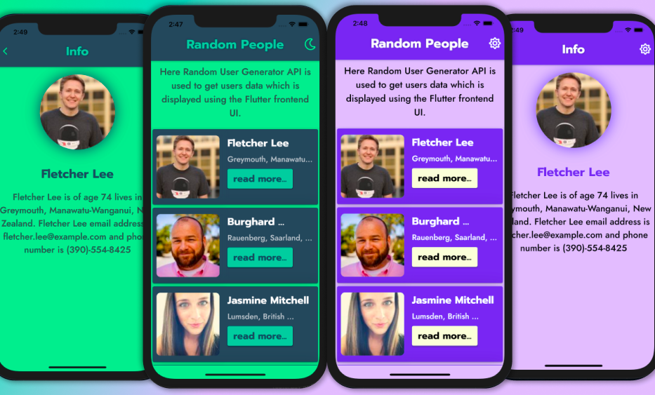

# random_people_fluttering

In this project [Random User Generator API](https://randomuser.me/) is used to get users data which is displayed using the `Flutter` frontend UI. The app has `2 themes (Green and Purple)` and they can be change just by clicking a button.

## Table of contents

- [Getting started](#getting-started)
- [Figma designs](#figma-designs)
- [App images](#app-images)
- [License](#license)

## Getting started

**Clone the repo**

```bash
git clone https://github.com/AkashSDas/random-people-fluttering
```

**Get inside the project dir and install dependencies**

```bash
cd random-people-fluttering
flutter pub get
```

**Open a simulator or connect a device and after that execute the below command to run the flutter app**

```bash
flutter run
```

## Figma designs

The `designs` for this app and output art design were made using `Figma` and the `.fig` files are in [/docs/design/ dir](https://github.com/AkashSDas/random-people-fluttering/tree/main/docs/design).

## App images



## License

[MIT](./LICENSE)
